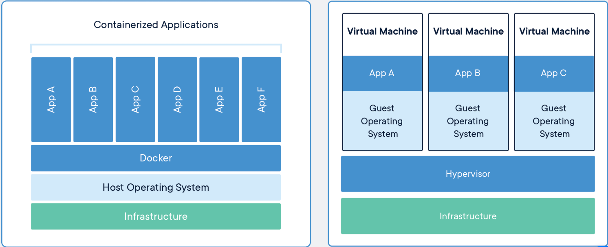

# Docker Training

## What will this training include?
- [ ]	[**Installation/Configuration**](#installation)
- [ ]	[**Containerize Applications**](#containerize-applications)
- [ ]	**Deployment**


## What is Docker?
> Docker is a tool designed to make it easier to create, deploy, and run applications by using containers.

## What are containers?
> A container is a set of one or more processes that are isolated from the rest of the system. All the files necessary to run them are provided from a distinct image, meaning that Linux containers are portable and consistent as they move from development, to testing, and finally to production

## Why use Docker?
> You are able to create, deploy, and move applications/solutions/tools from different environments w/ Docker. The container that you will create will have all of the necessary libraries, dependencies and files needed so that you can go from developmen to production. Docker makes it easier to host applications locally or in the cloud.

> Container images provide portability and version control, helping ensure that what works on a developer’s laptop also works in production

## Containerization v. Virtualization
* Virtualization lets your operating systems (Windows or Linux) run simultaneously on a single hardware system.  
---
* Containers share the same operating system kernel and isolate the application process from the rest of the system.



*Seeing is believing*

## Getting Started w/ Docker
> Usually we would have an installation step here, but this would take much time. To learn more about getting docker installed please reference the docs at: https://docs.docker.com/get-docker/

## Installation:
#### For this training, we will focus on a Windows based environment:
Navigate to the following link to follow along w/ installation: https://docs.docker.com/docker-for-windows/install/

## Containerize Applications
### What We Will Accomplish
- [ ] **Create A Dockerfile**
- [ ] **Containerize Predifined Application**
- [ ] **Run image as a container**
- [ ] **Access Container locally on port 80**

### Lets access our Docker environments.
#### Three virtual machines have already been set up w/ docker installed. No need for us to download it locally on our computer. To access your specificed virtual machine, I will provide you with the key and you will then run the following command:  
`ssh -i <private_key> vagrant@<IP>`
#### After gaining access, verify that docker is installed w/:
`docker -v`
#### You should see the following output:
```bash
Docker version 19.03.7, build 7141c199a2
```
### Let's Define A Image
To create our own image, we must first define a Dockerfile. A dockerfile is like a recipe for building a cake, but in our instance a image. Defining this file is the first step in containerizing an application.

#### Let's create a simple nginx image that copies files into container and serves a static site.
```yaml
# Image we are basing off of
FROM nginx:latest

# Set a working directory
WORKDIR /app

# Copy the contents of our current directory into the container
COPY . .
```
Now that we have the Dockerfile defined, we must now create a build of the image we specified.

#### Let's build our image.
`docker build -t nginx-custom .`

We should be able to see that our image was created using the following command: `docker image ls`. Output should be:
```sh
REPOSITORY          TAG                 IMAGE ID            CREATED             SIZE
nginx-custom        latest              64854d070707        0 minutes ago       127MB
```
> Now that we have our image created we need to run it and create our container

#### Let's create our container
`docker run --name nginx-custom-container -d -p 8000:80 nginx-custom`
* ***<--name>**: argument gives the container a name*  
* ***-d**: is to detach the process to the background*  
* ***-p**: is to specify the port information. Here we are portforwarding from 8000 on the host into 80 on the guest*  

> We can see that our container is up and running. To see all currently running containersn use the command: `docker container ls`. Output should be:
```sh
CONTAINER ID        IMAGE               COMMAND                  CREATED             STATUS              PORTS                  NAMES
0205bdce7cc8        nginx-custom        "nginx -g 'daemon of…"   18 minutes ago      Up 18 minutes       0.0.0.0:8000->80/tcp   nginx-custom-container
```

#### Lets verify that the container has the data we copied...
First open a interactive terminal
`docker exec -it nginx-custom-container bash`
> *-it stands for **Interactive Terminal**
> You should see a terminal opened:
```
root@0205bdce7cc8:/app#
```
Now let's check that the current working directory has our content.  
```bash
root@0205bdce7cc8:/app# ls
```
